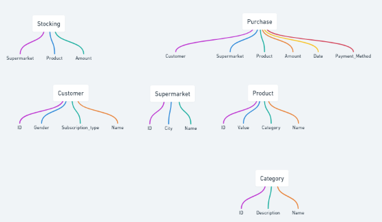

# Supermarket
Project for a Supermarket using Django as backend and Streamlit as frontend

# Data Structure for the project:

1. Customer
    - ID
    - Name
    - Gender
    - Subscription_type

2. Supermarket
    - ID
    - Name
    - City

3. Stocking
    - Supermarket
    - Product
    - amount

4. Product
    - ID
    - Name
    - Value
    - Category

5. Category
    - ID
    - Name
    - Description

6. Purchase
    - Customer
    - Supermarket
    - Product
    - amount
    - date
    - payment_method
    

